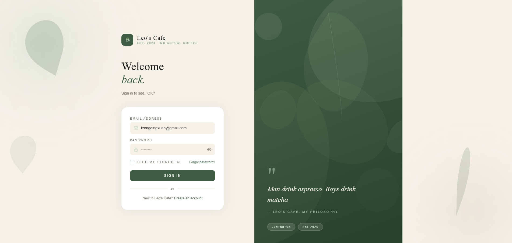
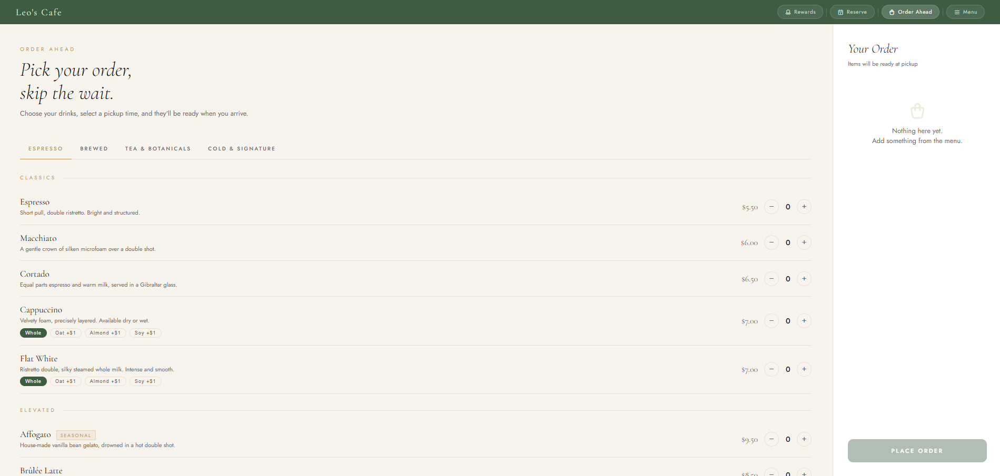
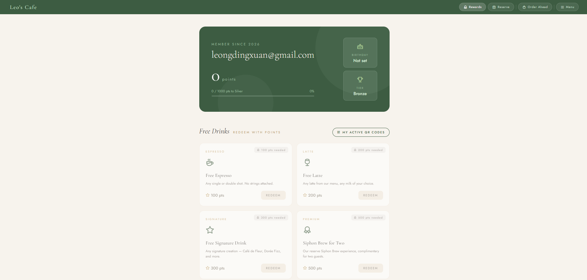
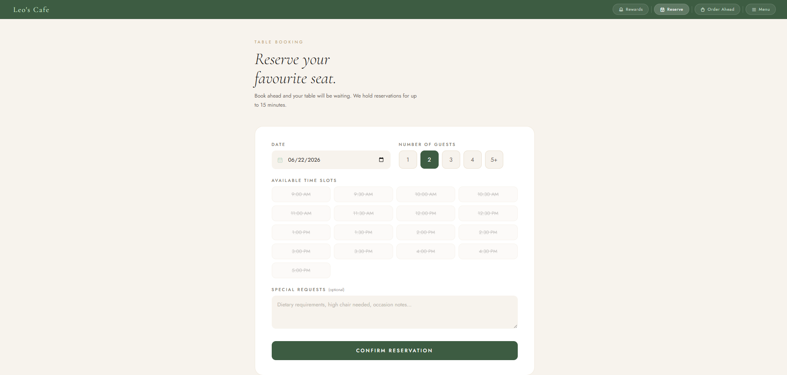

# Leo's Cafe

A full-stack cafe management web application built as a personal project to strengthen software development skills after NS. The platform simulates a real cafe experience — users can browse the menu, place orders ahead of time, track order status, earn and redeem loyalty rewards, make table reservations, and manage their accounts securely.

---

## Live Demo

https://leocafe.vercel.app

Demo Account  
Email: Test@gmail.com  
Password: Test12345!

---

## Tech Stack

| Layer | Technologies |
|---|---|
| Frontend | HTML, CSS, Vanilla JavaScript |
| Backend | Node.js, Express.js |
| Database | PostgreSQL (Neon serverless) |
| Auth | JWT, bcrypt |
| Email | SendGrid |
| Deployment | Vercel |
| Fonts & Icons | Cormorant Garamond, Jost (Google Fonts), Tabler Icons |

---

## Features

### Authentication
- User registration with password strength validation
- Login with JWT session management
- "Keep me signed in" — 30-day session vs 1-hour default
- Forgot password flow with 6-digit email verification code

### Menu
- Tabbed browser across four categories: Espresso, Brewed Coffee, Tea & Botanicals, Cold & Signature
- Seasonal and reserve item badges

### Order Ahead
- Add items to cart with quantity controls
- Milk type selection per drink with upcharge reflected in total
- Multiple variants of the same drink tracked separately in cart
- Pickup time selection with 30-minute advance buffer
- Points estimate shown before checkout
- Order saved to database on placement

### Order Status
- Dedicated status page per order with order number
- Animated "Preparing your order" state with live polling every 10 seconds
- Automatically flips to "Ready for collection" at pickup time
- Orders history page — view and revisit all past orders

### Rewards & Loyalty
- Earn 10 points per dollar spent
- Redeem points for free drinks and discounts
- Tiered membership:
  - Bronze — default
  - Silver — 1,000 cumulative pts (5% off redemptions)
  - Gold — 5,000 cumulative pts (10% off redemptions)
- QR code generated on redemption for counter verification
- Active QR codes page with 24-hour expiry
- Redemption history log

### Table Reservations
- Date picker, guest count (1–5+), and 30-minute time slots
- Real-time slot availability — booked slots greyed out server-side
- Past slots automatically disabled for same-day bookings
- View and cancel upcoming reservations

### Profile Management
- Edit username and birthday
- Change email with 6-digit verification code sent to current email
- Change password with current password confirmation + verification code
- View loyalty points, tier, and member since date

---

## Architecture

A Multi-Page Application (MPA) where each page is a separate HTML file served by Express, with its own JavaScript file that communicates with the REST API via `fetch()`. No frontend framework — vanilla JS throughout.

```
Browser
├── views/          HTML pages served by Express
└── public/js       Per-page scripts calling the API via fetch()

Vercel
├── Static assets (CSS/JS) → served from edge CDN
└── Page & API requests    → routed to Express serverless function

Express (server.js)
├── auth.js middleware     JWT verification on protected routes
├── routes/auth.js         Register, login, forgot password
├── routes/orders.js       Order creation and status
├── routes/reservations.js Booking management
├── routes/rewards.js      Points, tiers, redemptions
└── routes/profile.js      Account management

External Services
├── Neon PostgreSQL         users, orders, reservations, redemptions
└── SendGrid                Transactional email (verification codes)
```

---

## Security

- Passwords hashed with bcrypt (10 salt rounds)
- JWT on all protected API routes
- Email verification codes for sensitive changes (email, password, forgot password)
- Verification codes expire after 15 minutes, single-use enforced in DB
- Environment variables never committed — managed via `.env` / Vercel dashboard

---

## Project Structure

```
├── db/
│   ├── db.js               # PostgreSQL connection pool (supports DATABASE_URL for production)
│   └── setup.sql           # All table definitions
├── middleware/
│   └── auth.js             # JWT verification middleware
├── routes/
│   ├── auth.js             # Register, login, /me, forgot password
│   ├── orders.js           # Order creation and status
│   ├── profile.js          # Profile CRUD + email/password change flows
│   ├── reservations.js     # Booking CRUD + slot availability
│   └── rewards.js          # Points, tiers, redemptions, QR codes
├── public/
│   ├── css/                # Per-page stylesheets
│   └── js/                 # Per-page frontend scripts
├── views/                  # Server-rendered HTML pages
├── vercel.json             # Vercel deployment config
├── server.js               # Express app entry point
└── .env.example            # Environment variable template
```

---

## Local Setup

This project uses [Neon](https://neon.tech) (serverless PostgreSQL) — no local database installation required.

1. Clone the repo and install dependencies:
   ```bash
   git clone https://github.com/LLDX03/leocafe.git
   cd leocafe
   npm install
   ```

2. Create a free database at [neon.tech](https://neon.tech) and run `db/setup.sql` in the Neon SQL Editor to create all tables.

3. Copy `.env.example` to `.env` and fill in your values.

   **Option A — Neon (recommended, no local install):**
   ```
   JWT_SECRET=your_jwt_secret

   DATABASE_URL=your_neon_connection_string

   SENDGRID_API_KEY=your_sendgrid_key
   SENDGRID_FROM_EMAIL=your_sender_email
   ```

   **Option B — Local PostgreSQL:**
   ```
   JWT_SECRET=your_jwt_secret

   DB_USER=your_database_user
   DB_HOST=your_database_host
   DB_NAME=your_database_name
   DB_PASSWORD=your_database_password
   DB_PORT=5432

   SENDGRID_API_KEY=your_sendgrid_key
   SENDGRID_FROM_EMAIL=your_sender_email
   ```

4. Start the backend server:
   ```bash
   npm start
   ```

5. Visit `http://localhost:3000`

---

## Deployment

The app is deployed on **Vercel** with **Neon** (serverless PostgreSQL).

- Push to `main` triggers an automatic Vercel deployment
- Set the following environment variables in the Vercel dashboard:
  - `DATABASE_URL` — Neon connection string
  - `JWT_SECRET`
  - `SENDGRID_API_KEY`
  - `SENDGRID_FROM_EMAIL`

---

## Screenshots

**Login**


**Order Ahead**


**Loyalty Rewards**


**Table Reservation**


---

