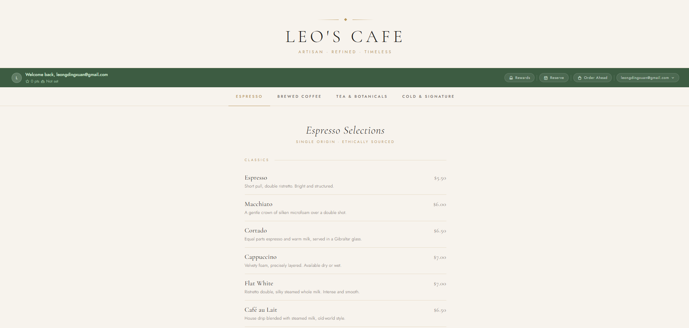

# ☕ Leo's Cafe

A full stack cafe management web application built as a side project to refresh and strengthen my software development skills after NS.

The system simulates a real cafe platform where users can browse menus, place orders ahead of time, earn and redeem loyalty rewards, make table reservations, and manage their accounts securely.

**Screenshots and video is provided in the bottom section**

---

## 🛠️ Tech Stack

### Frontend
- HTML, CSS, JavaScript
- Cormorant Garamond & Jost (Google Fonts)
- Tabler Icons

### Backend
- Node.js + Express.js
- RESTful API architecture

### Database
- PostgreSQL

### Authentication & Security
- JWT (JSON Web Tokens)
- bcrypt password hashing
- Input validation & protected routes

### Services & Libraries
- SendGrid — transactional email (verification codes)
- dotenv — environment variable management
- CORS — cross-origin request handling
- qrcodejs — QR code generation for reward redemptions

---

## ✨ Features

### 🔐 Authentication
- User registration with strong password validation
- Login with JWT session management
- Forgot password flow with email verification code
- Configurable session duration (1 hour default, 24 hours with "Keep me signed in")

### 🍽️ Menu
- Tabbed menu browser across four categories: Espresso, Brewed Coffee, Tea & Botanicals, Cold & Signature
- Seasonal and signature item badges

### 🛒 Order Ahead
- Add items to cart with quantity controls
- Milk type selection per drink
- Pickup time selection
- Points estimate shown before checkout

### 🎁 Rewards & Loyalty
- Earn points on every order (10 pts per dollar)
- Redeem points for free drinks and discounts
- Tiered membership system:
  - 🥉 Bronze — default
  - 🥈 Silver — 1,000 accumulative pts (5% off redemptions)
  - 🥇 Gold — 5,000 accumulative pts (10% off redemptions)
- QR code generated on redemption for counter verification
- Active QR codes page with 24-hour expiry
- Redemption history log

### 👤 Profile
- Edit username and birthday
- Change email with 6-digit verification code (sent to current email)
- Change password with current password confirmation + verification code
- View loyalty points, tier, and member since date

### 📅 Reservations
- Pick date, guest count (1–6+), and time slot
- Real-time slot availability — taken slots are greyed out
- Past time slots automatically disabled when booking for today
- View and cancel upcoming reservations

---

## 🔐 Security
- Passwords hashed with bcrypt (10 rounds)
- JWT authentication on all protected routes
- Email verification codes for sensitive account changes (email, password, forgot password)
- Codes stored in DB with 15-minute expiry and single-use enforcement
- Environment variables via dotenv (never committed)

---

## 📁 Project Structure

```
├── db/
│   ├── db.js               # PostgreSQL connection pool
│   └── setup.sql           # Table definitions
├── middleware/
│   └── auth.js             # JWT verification middleware
├── routes/
│   ├── auth.js             # Register, login, /me, forgot password
│   ├── profile.js          # Profile CRUD + email/password change
│   ├── reservations.js     # Booking CRUD + slot availability
│   └── rewards.js          # Points, tiers, redemptions, QR codes
├── public/
│   ├── css/                # Per-page stylesheets
│   └── js/                 # Per-page frontend scripts
├── views/                  # HTML pages
├── server.js               # Express app entry point
└── .env                    # Environment variables (not committed)
```

---

## ⚙️ Setup

1. Clone the repo and install dependencies:
   ```bash
   npm install
   ```

2. Copy `.env.example` to `.env` and fill in your values:
   ```
   JWT_SECRET=your_jwt_secret_here

   DB_USER=your_database_user
   DB_HOST=your_database_host
   DB_NAME=your_database_name
   DB_PASSWORD=your_database_password
   DB_PORT=5432

   SENDGRID_API_KEY=your_sendgrid_api_key_here
   SENDGRID_FROM_EMAIL=your_email@example.com
   ```

3. Run the SQL setup to create tables:
   ```bash
   psql -U <user> -d <database> -f db/setup.sql
   ```

4. Start the server:
   ```bash
   node server.js
   ```

5. Open `views/login.html` in your browser or serve via a local server.

---

## 📸 Screenshots

**Login**


**Menu**


**Order Ahead**


**Loyalty Rewards**


**Table Reservation**


---

## 💡 Inspiration

Always wanted to open a café someday 

---

## 📚 References

- [Claude](https://claude.ai/) — UI/UX design & code assistance
- [ChatGPT](https://chatgpt.com/) — troubleshooting
- [W3Schools](https://www.w3schools.com/) — reference
- [node-postgres](https://node-postgres.com/) — PostgreSQL client docs
- [SendGrid Docs](https://docs.sendgrid.com/) — email integration
- [Tabler Icons](https://tabler.io/icons) — icon set
